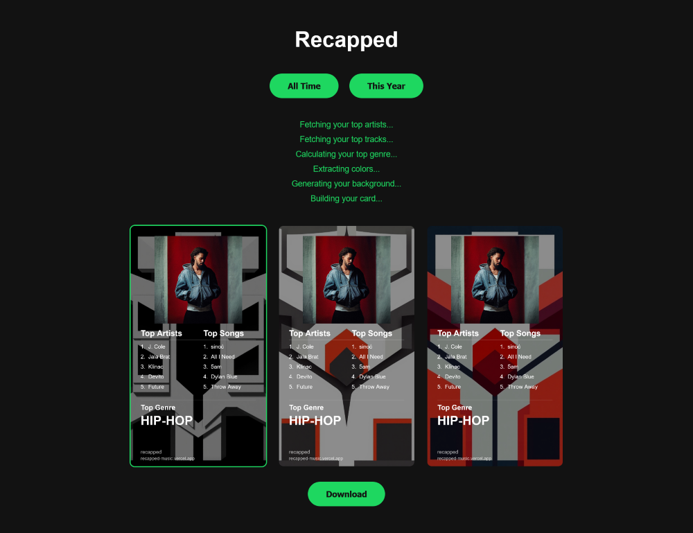

# Recapped
> Recapped is an independent project and is not affiliated with, endorsed by, or sponsored by Spotify.

Create personalized music recap posters from your Spotify listening history, whenever you want.

**Live:** [recapped-music.vercel.app](https://recapped-music.vercel.app)

## What it does

Recapped connects to your Spotify account, fetches your listening data, extracts album artwork colors, generates AI-powered backgrounds, and composites everything into downloadable poster-style recap cards.

Choose between three generated variants and save your favorite as a JPEG.

## How it works

1. **Connect with Spotify** — secure OAuth login using PKCE
2. **Pick a range** — All Time or This Year
3. **Fetch listening data** — top artists, top tracks, and a calculated top genre
4. **Extract colors** — dominant colors are pulled from your album artwork
5. **Generate backgrounds** — three AI-generated designs are created
6. **Composite the final card** — choose your favorite and download it

## Tech stack

- **Frontend:** Vite, Vanilla JS, HTML Canvas
- **Backend:** Vercel Serverless Functions
- **Data:** Spotify Web API, Last.fm API
- **Image generation:** Pollinations.ai
- **Session storage:** Upstash Redis
- **Hosting:** Vercel

## Security

- OAuth + PKCE authentication
- Third-party API keys never reach the browser
- Requests are proxied through serverless functions
- Spotify refresh tokens are stored server-side in Redis
- API routes validate input, verify request origins, and are rate-limited